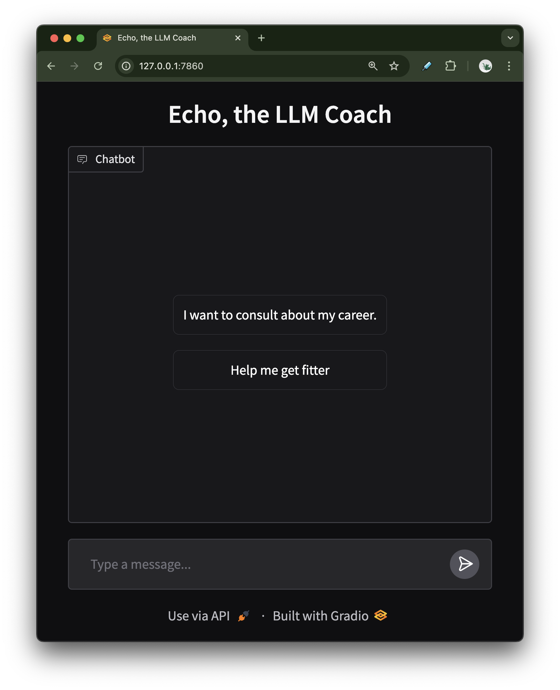

# langchain-first-step
First steps to LangChain by Case Done. The final product is a small app 'LLM as a Coach'.

> This repo was first created for Case Done's webinar [LLM App Development for Beginner](https://www.eventbrite.co.uk/e/llm-app-development-for-beginners-tickets-1078559082249?aff=oddtdtcreator) on Dec 5, 2024.

## What we use
- LangChain
- LangGraph
- Ollama
- OpenAI API

## Connect with Us:
👍 Like | 🔗 Share | 📢 Subscribe    
Follow us on [YouTube](https://www.youtube.com/@CaseDonebyAI), [LinkedIn](www.linkedin.com/company/casedonebyai), and [Facebook](https://www.facebook.com/casedonebyai/)! Look for *@casedonebyai*   
💬 Comments? Questions? We value your feedback and look forward to engaging with you!